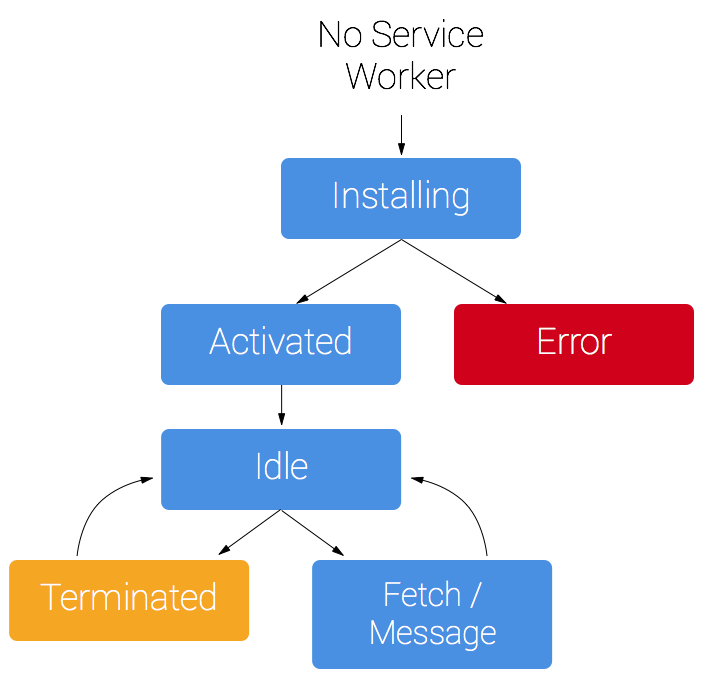

# 4. Construir una app desde nuestro website

## Manifest

Lo primero a realizar para hacer que nuestro sitio web se comporte como una aplicación, es agregar un archivo con información llamado Web App Manifest. Este archivo está escrito en formato json con campos bien definidos.

1. Agregar un nuevo archivo llamado `manifest.json` dentro de la carpeta **public**.

1. En el archivo, agregar el siguiente contenido.

    ```json
    {
        "dir": "ltr",
        "lang": "en",
        "name": "Progressive Expenses",
        "short_name": "PE",
        "description": "A simple progressive expense app to track your expenses",
        "start_url": "http://localhost:3000/",
        "scope": "/",
        "display": "standalone",
        "orientation": "any",
        "theme_color": "#3A475B",
        "background_color": "#3A475B",
        "related_applications": [],
        "prefer_related_applications": false,
        "icons": [
            {
                "src": "http://localhost:3000/img/logo-144.png",
                "type": "image/png",
                "sizes": "144x144"
            },
            {
                "src": "http://localhost:3000/img/logo-194.png",
                "type": "image/png",
                "sizes": "194x194"
            },
            {
                "src": "http://localhost:3000/img/logo-512.png",
                "type": "image/png",
                "sizes": "512x512"
            }
        ]
    }
    ```

    > **Nota**: el manifest apunta a definir información del sitio para ser tratado como una aplicación, entre otras cosas, el nombre a mostrar, colores a utilizar, orientaciones, forma en la que se muestra, iconos, etc.
    > - **dir**: TBC
    > - **lang**: TBC
    > - **name**: TBC
    > - **short_name**: TBC
    > - **description**: TBC
    > - **start_url**: TBC
    > - **scope**: TBC
    > - **display**: TBC
    > - **orientation**: TBC
    > - **theme_color**: TBC
    > - **background_color**: TBC
    > - **related_applications**: TBC
    > - **prefer_related_applications**: TBC
    > - **icons**: TBC

1. Ahora

1. Por último, agregar los assets que faltan que definimos en el manifest como iconos dentro de la carpeta `img`, para esto, copiarlos desde `TBC`.

Poner screenshots de las distintas opciones de display

Agregar el tag


## Consumir datos
JSON estático
AJAX
Mejorar AJAX por Promises
Cambiar AJAX por Fetch
Si no existe fetch no rompamos!

## Intro a SW
Qué es

Cómo funciona

Requisitos
HTTPS

1. Lo primero a realizar es crear un archivo en el root de nuestro sitio que tendrá la lógica del Service Worker. Para esto agregamos un nuevo archivo con el nombre `service-worker.js` en la carpeta **public**.

1. Dentro de este archivo agregamos el siguiente código.

    ```js
    (function() {
        'use strict';

    })();
    ```

1. Ahora, necesitamos crear un nuevo archivo para agregar la lógica para registrar el service worker en nuestro sitio. Para eso, agregamos un archivo nuevo dentro de la carpeta **public/js** llamado `sw-registration.js`.

1. Dentro de `sw-registration.js` agregamos el siguiente código para registrar el service worker si es que el navegador lo soporta.

    ```js
    if ('serviceWorker' in navigator) {
        navigator.serviceWorker.register('service-worker.js')
        .then(function(registration) {
            console.log('Registered:', registration);
        })
        .catch(function(error) {
            console.log('Registration failed: ', error);
        });
    }
    ```

    > **Nota**: Si la propiedad `serviceWorker` existe dentro de la variable `navigator`, es porque el navegador lo soporta. 


1. A la hora de entender el service worker, una de las cosas principales es su ciclo de vida.

    

    _Ciclo de vida del service worker_


1. Para visualizar este ciclo de vida vamos a agregar el siguiente código para que el service worker escuche a eventos de tipo `install` y escriba en el log el evento.

    ```js
    self.addEventListener('install', function(event) {
        console.log('On install');
        console.log(event);
    });
    ```

    > **Nota**: El evento install es muy útil para TBC

1. Ahora, agregar el siguiente código para que el service worker escuche a eventos de tipo `activate` y escriba en el log el evento.

    ```js
    self.addEventListener('activate', function(event) {
        console.log('On activate');
        console.log(event);
    });
    ```

    > **Nota**: El evento install es muy útil para TBC

1. Correr el sitio y ver los logs (TBC)


1. Ahora, agregar el siguiente código para que el service worker escuche a eventos de tipo `fetch` y realize la operación agregando un log de cada pedido.

    ```js
    self.addEventListener('fetch', function(event) {
        console.log(event.request);
        return fetch(event.request);
    });
    ```

    > **Nota**: Este ejemplo es trivial, dado que no hace falta realizarlo a mano, pero nos permite ver que podemos estar en el medio de cada pedido a un servidor.


1. Correr el sitio y ver los logs (TBC)


## Instalando nuestro sitio como app

Probar en devtools. Click en add to homescreen
Mostrar opciones de trackeo

1. Abrir el `manifest.json`, localizar la propiedad `start_url` y actualizar el valor por el siguiente.

    ```json
    "start_url": "http://localhost:3000/?utm_source=pwa&utm_medium=pwasite&utm_campaign=start",
    ```

    > **Nota**: Podemos cambiar la start_url para que cuando se inice la aplicación instalada use una url especial, dando una mejor experiencia a los usuarios, así como agregar parametros para tener un mejor tracking y entender si nuestro usuarios usan la app o entran al sitio directamente.

Cuántos entran desde el ícono con start_url
beforeinstallprompt para saber si aceptó o no