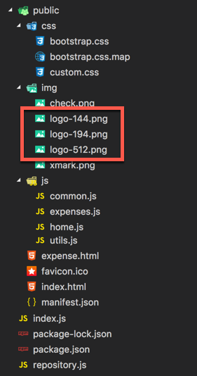
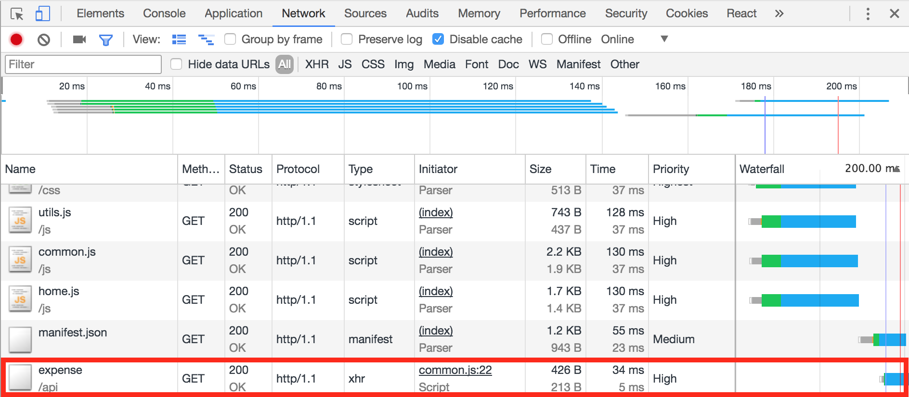
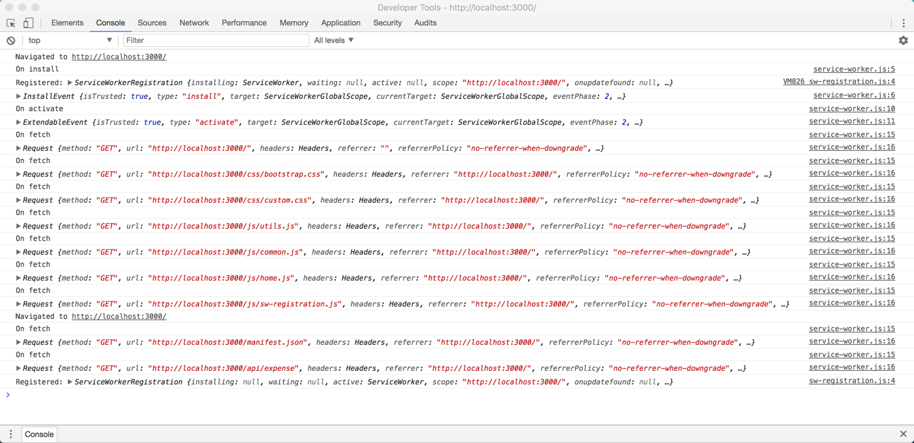
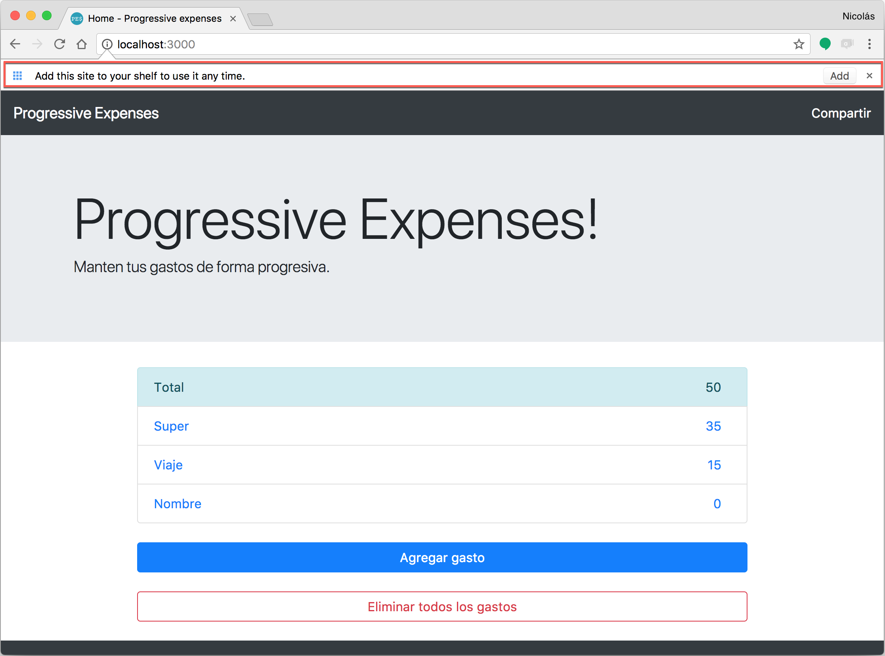
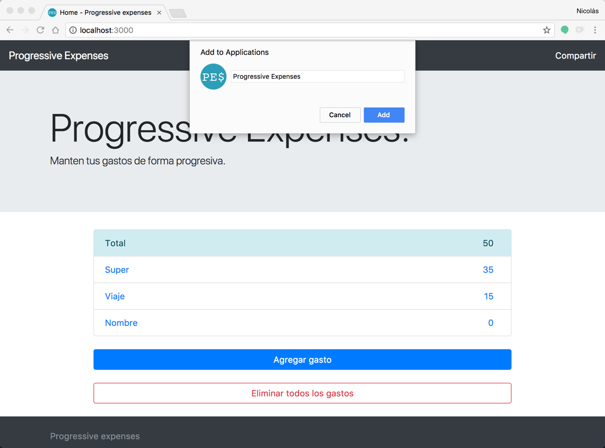

# 4. Construir una app desde nuestro website

En este módulo vamos ver y agregar el Web App Manifest y un Service Worker muy simple para poder hacer nuestro sitio instalable como si fuese una aplicación nativa.

## El Web App Manifest

Lo primero a realizar para hacer que nuestro sitio web se comporte como una aplicación, es agregar un archivo con la información necesaria, llamado [Web App Manifest](https://w3c.github.io/manifest/). Este archivo está escrito en formato _json_ con campos bien definidos.

1. Para arrancar, agregar un nuevo archivo llamado `manifest.json` dentro de la carpeta **public**.

1. En el nuevo archivo, agregar el siguiente contenido.

    ```json
    {
        "dir": "ltr",
        "lang": "en",
        "name": "Progressive Expenses",
        "short_name": "PE",
        "description": "A simple progressive expense app to track your expenses",
        "start_url": "http://localhost:3000/",
        "scope": "/",
        "display": "standalone",
        "orientation": "any",
        "theme_color": "#3A475B",
        "background_color": "#3A475B",
        "related_applications": [],
        "prefer_related_applications": false,
        "icons": [
            {
                "src": "http://localhost:3000/img/logo-144.png",
                "type": "image/png",
                "sizes": "144x144"
            },
            {
                "src": "http://localhost:3000/img/logo-194.png",
                "type": "image/png",
                "sizes": "194x194"
            },
            {
                "src": "http://localhost:3000/img/logo-512.png",
                "type": "image/png",
                "sizes": "512x512"
            }
        ]
    }
    ```

    > **Nota**: el manifest apunta a definir información del sitio para ser tratado como una aplicación, entre otras cosas, el nombre a mostrar, colores a utilizar, orientación de pantalla, forma en la que se muestra, íconos, etc.
    > - **dir**: Especifica la dirección del texto para `name`, `short_name`, y `description`. Junto con `lang`, ayuda a representar correctamente los idiomas que se escriben de derecha a izquierda. Puede tener uno de los siguientes valores: **ltr** (izquierda a derecha), **rtl** (derecha a izquierda), **auto** (indica al navegador que use el algoritmo Unicode bidirectional para hacer una estimación apropiada sobre la dirección del texto.)
    > - **lang**: Especifica el idioma principal.
    > - **name**: Especifica el nombre de la aplicación para mostrarle al usuario.
    > - **short_name**: Proporciona un nombre corto para la aplicación. Está pensado para ser usado cuando hay poco espacio para mostrar el nombre completo de la aplicación.
    > - **description**: Proporciona una descripción general sobre qué hace la aplicación.
    > - **start_url**: Especifica la URL que se carga cuando el usuario lanza la aplicación desde un dispositivo. 
    > - **scope**: Define el ámbito de navegación en el contexto de la aplicación web. Esto básicamente restringe qué páginas se pueden ver cuando se aplica el manifiesto. Si el usuario navega fuera del `scope` de la aplicación, continúa como en una web normal.
    > - **display**: Define el modo de visualización preferido para la aplicación web.
    >
    >   | display    | Descripción                                                                                                                                                                                                                                                                                                           | fallback display |
    >   |------------|-----------------------------------------------------------------------------------------------------------------------------------------------------------------------------------------------------------------------------------------------------------------------------------------------------------------------|------------------|
    >   | fullscreen | Se utiliza toda la pantalla disponible, no se muestran elementos del user agent.                                                                                                                                                                                                                               | standalone       |
    >   | standalone | La aplicación se mostrará como una app independiente. Así la aplicación puede tener su propia ventana, su propio icono en el lanzador de aplicaciones, etc. En este modo, el user agent excluirá los elementos de interfaz para controlar la navegación, pero puede incluir otros elementos como la barra de estado.  | minimal-ui       |
    >   | minimal-ui | La aplicación se mostrará como una app independiente, pero tendrá un mínimo de elementos de interfaz para controlar la navegación. Estos elementos podrán variar según navegador.                                                                                                                                     | browser          |
    >   | browser    | La aplicación se abrirá en una pestaña nueva del navegador o una ventana nueva, dependiendo del navegador y plataforma. Esto es por defecto.                                                                                                                                                                          | (ninguno)        | 
    > - **orientation**: Define la orientación por defecto. Puede ser: **any**, **natural**, **landscape**, **landscape-primary**, **landscape-secondary**, **portrait**, **portrait-primary**, **portrait-secondary**
    > - **theme_color**: Define el color por defecto para la aplicación. Esto en ocasiones afecta como se muestra por el sistema operativo (por ejemplo, en el lanzador de aplicaciones de Android, el color envuelve la aplicación).  
    > - **background_color**: Define el color de fondo deseado para la aplicación. Este valor repite lo definido en la hoja de estilos de la aplicación, pero puede ser utilizado por los navegadores para pintar el color de fondo de una app si el manifiesto está disponible antes de que la hoja de estilos se haya cargado. Esto suaviza la transición entre lanzar una aplicación y cargar el contenido de la misma.
    > - **related_applications**: Un array especificando las aplicaciones nativas relacionadas disponibles.
    > - **prefer_related_applications**: Un valor booleano que especifica si sugerirle al usuario que existe una aplicación nativa disponible y recomendada sobre la experiencia web. Sólo debería ser utilizado si la aplicación nativa ofrece una experiencia realmente superadora. Para la sugerencia utiliza lo especificado en `related_applications`
    > - **icons**: Especifica un array de imágenes que pueden servir como íconos de la aplicación en diferentes contextos. Por ejemplo, se pueden utilizar para representar la aplicación entre un listado de aplicaciones, o para mostrar la pantalla de Splash.

1. Antes de avanzar, localizar la propiedad `start_url` y actualizar el valor por el siguiente.

    ```json
    "start_url": "http://localhost:3000/?utm_source=pwa&utm_medium=pwasite&utm_campaign=start",
    ```

    > **Nota**: Podemos cambiar la start_url para que cuando se inicie la aplicación instalada use una url especial, dando una mejor experiencia a los usuarios, así como agregar parámetros para tener un mejores mediciones y entender si nuestros usuarios usan la app o entran al sitio directamente.

1. Ahora, abrir el archivo `index.html` dentro de la carpeta `public` y agregar la siguiente línea en el header, debajo del meta tag `viewport`.

    ```html
    <link rel="manifest" href="/manifest.json">
    ```

1. Vamos a aprovechar a agregar también otro meta tag para definir el color que puede llegar a tomar el browser theme, para esto, agregar arriba del elemento recién agregado el siguiente elemento.

    ```html
    <meta name="theme-color" content="#3A475B"/>
    ```

1. Repetir las operaciones anteriores en el archivo `expense.html`.

    ```html
    <meta name="theme-color" content="#3A475B"/>
    <link rel="manifest" href="/manifest.json">
    ```

1. Por último, agregar las imágenes que definimos en el manifest como iconos dentro de la carpeta `img`. Para esto, copiar todas las imagenes de la carpeta `assets` localizada en este módulo a la carpeta `public/img` de la solución.

    

    _Los assets en la carpeta img_

1. Ejecutar la applicación con `npm start` y navegar en el browser a [http://localhost:3000](http://localhost:3000).

1. Abrir las _Developer Tools_ del browser,  seleccionar la solapa **Application** y ver la información que figura en la misma dentro de la categoría **Manifest**.

    

    _La información del manifest que podemos ver en las developer tools_


## Consumir datos desde el servidor

Un paso importante a la hora de trabajar en aplicaciones web es consumir datos desde una API, sin cargar todo el sitio entero cada vez que querramos hacer un cambio. Para esto, una opción conocida es la utilización de _AJAX (Asynchronous JavaScript And XML)_, pero en la actualidad, aparece una nueva API del navegador llamada _Fetch_, que nos permite hacer estas operaciones con mayor facilidad, un mejor manejo asincrónico gracias al uso de promesas y la posibilidad de interceptar los requests desde el service worker como se verá más adelante.

### Migrando a usar los datos con AJAX

1. Abrir el archivo `common.js` dentro de `public/js` y notar que la implementación actual llama en todas las operaciones a una función llamada `apiClient`.

    ```js
    function saveExpense(expense, cb) {
        apiClient(`${serverUrl}api/expense/${expense.id || ''}`, {
            method: 'POST',
            headers: {
                'Content-Type': 'application/json'
            },
            body: JSON.stringify(expense)
        }, cb);
    }

    function deleteExpenses(cb) {
        try {
            apiClient(`${serverUrl}api/expense`, { method: 'DELETE' }, cb);
        } catch (error) {
            alert("Error deleting expenses");
        }
    }

    function getExpenses(cb) {
        apiClient(`${serverUrl}api/expense`, {}, cb)
    }

    function getExpense(expenseId, cb) {
        apiClient(`${serverUrl}api/expense/${expenseId}`, {}, cb);
    }
    ```

1. La función `apiClient` localizada al inicio del archivo, implementa una llamada AJAX genérica que nos permite leer y escribir los datos en el servidor.

    ```js
    function apiClient(url, options, success, error) {
        options = options || {};
        let request = new XMLHttpRequest();
        
        request.open(options.method || 'get', url);
        request.setRequestHeader('Content-type', 'application/json');

        request.onload = () => {
            if (request.status == 200 && request.getResponseHeader('Content-Type').indexOf('application/json') !== -1) {
                const responseObj = JSON.parse(request.response);
                if (success) {
                    success(responseObj);
                }
            } else {
                throw new TypeError();
            }
        };

        request.onerror = error;

        request.send(options.body);
    }
    ```

    > **Nota**: la función **apiClient** tiene cuatro parámetros:
    > - **url**: a la cual vamos a hacer el request.
    > - **options**: este objeto donde tenemos el _method_ que tendrá el request (_ej. GET, POST, PUT, etc._) y el body en caso de tenerlo (para request como _POST_ y _PUT_).
    > - **success**: función de callback que se llama en caso de que termine bien la llamada, que recibe el objeto ya procesado.
    > - **error**: función de callback que se llama en caso de error.
    >
    > La llamada al servidor se hace por medio del objeto `XMLHttpRequest`, configurando todos los event handlers como `onload` y `onerror`.

1. Ejecutar nuevamente la aplicación. Si abrimos las dev tools podremos ver que estamos accediendo al server en el panel `Network`, así como también en los logs del server en la consola como vimos anteriormente.

    

    _Solapa Network de las Developer tools_


### Conociendo las promesas

<!-- https://developer.mozilla.org/es/docs/Web/JavaScript/Referencia/Objetos_globales/Promise -->

El objeto `Promise` (Promesa) es usado para computaciones asíncronas. Una promesa representa un valor que puede estar disponible ahora, en el futuro, o nunca.

La sintaxis es la siguiente.

```js
new Promise( function(resolver, rechazar) { ... } );
```

El parámetro que es una función con los argumentos resolver y rechazar. Esta función es ejecutada inmediatamente por la implementación de la Promesa, pasándole las funciones resolver y rechazar (el ejecutor es llamado incluso antes de que el constructor de la Promesa devuelva el objeto creado). Las funciones resolver y rechazar, al ser llamadas, resuelven o rechazan la promesa, respectivamente. Normalmente el ejecutor inicia un trabajo asíncrono, y luego, una vez que es completado, llama a la función resolver para resolver la promesa o la rechaza si ha ocurrido un error.
Si un error es lanzado en la función ejecutor, la promesa es rechazada y el valor de retorno del ejecutor es rechazado.


1. Abrir el archivo `common.js`. Actualizar la implementación de la función `apiClient` para que funcione con _Promises_ en vez de con callbacks, remplázandola por la siguiente implementación.

    ```js
    function apiClient(url, options) {
        options = options || {};
        return new Promise( (resolve, reject) => {
            let request = new XMLHttpRequest();
            
            request.open(options.method || 'get', url);
            request.setRequestHeader('Content-type', 'application/json');

            request.onload = () => {
                if (request.status === 200 && request.getResponseHeader('Content-Type').indexOf('application/json') !== -1 ) {
                    const responseObj = JSON.parse(request.response);
                    resolve(responseObj);
                } else {
                    reject(new TypeError());
                }
            };

            request.onerror = reject;

            request.send(options.body);
        });
    }
    ```

1. Ahora hay que actualizar el código existente para usar esta función. Para esto, actualizar las funciones `saveExpense`, `deleteExpenses`, `getExpenses` y `getExpense` para hacer uso de las _Promises_ en vez de usar callbacks.

    ```js
    function saveExpense(expense, cb) {
        apiClient(`${serverUrl}api/expense/${expense.id || ''}`, {
            method: 'POST',
            headers: {
                'Content-Type': 'application/json'
            },
            body: JSON.stringify(expense)
        }).then(cb);
    }

    function deleteExpenses(cb) {
        apiClient(`${serverUrl}api/expense`, { method: 'DELETE' })
            .then(cb)
            .catch(() => alert("Error deleting expenses"));
    }

    function getExpenses(cb) {
        apiClient(`${serverUrl}api/expense`)
            .then(cb);
    }

    function getExpense(expenseId, cb) {
        apiClient(`${serverUrl}api/expense/${expenseId}`)
            .then(cb);
    }
    ```

1. Ejecutar nuevamente la aplicación y ver que funcione todo como antes.

### Migrando a Fetch

<!-- https://developer.mozilla.org/es/docs/Web/API/Fetch_API -->

La _API Fetch_ proporciona una interfaz para recuperar recursos (incluyendo recursos remotos a través de redes). Le resultará familiar a cualquiera que haya usado `XMLHttpRequest`, pero esta nueva API ofrece un conjunto de características más potente y flexible.

_Fetch_ ofrece una definición genérica de los objetos _Request_ y _Response_ (y otras cosas relacionados con las solicitudes de red). Esto permitirá que sean utilizados donde sea necesario en el futuro, ya sea para los service workers, _cache API_ y otros lugares similares que manipulan o modifican las solicitudes y respuestas. O en general, en cualquier tipo de caso de uso que podría requerir la generación de sus propias respuestas mediante programación.

Vamos a aprovechar esta API migrando nuestro código.

1. Abrir el archivo `common.js`. Actualizar la implementación de la función `apiClient` para que use `fetch`, remplázandola por la siguiente implementación.

    ```js
    function apiClient(url, options) {
        options = options || {};
        return fetch(url, options);
    }
    ```

1. Dado que fetch es más flexible que nuestra implementación anterior de la función `apiClient`, tenemos que aclarar qué tipo de respuesta queremos a la hora de consumirlo. En nuestro caso queremos usar json, para lo cual antes hacíamos uso de `JSON.parse`. Para esto, actualizar nuevamente las funciones que consumen apiClient con el siguiente código.

    ```js
    function saveExpense(expense, cb) {
        apiClient(`${serverUrl}api/expense/${expense.id || ''}`, {
            method: 'POST',
            headers: {
                'Content-Type': 'application/json'
            },
            body: JSON.stringify(expense)
        })
        .then(response => response.json())
        .then(cb);
    }

    function deleteExpenses(cb) {
        apiClient(`${serverUrl}api/expense`, { method: 'DELETE' })
            .then(response => response.json())
            .then(cb)
            .catch(() => alert("Error deleting expenses"));
    }

    function getExpenses(cb) {
        apiClient(`${serverUrl}api/expense`)
            .then(response => response.json())
            .then(cb);
    }

    function getExpense(expenseId, cb) {
        apiClient(`${serverUrl}api/expense/${expenseId}`)
            .then(response => response.json())
            .then(cb);
    }
    ```

    > **Nota**: El objeto que devuelve fetch tiene algunos métodos que nos ayudan a consumir más simplemente los datos que pedimos, entre ellos `json()`, `text()` y `blob()`.

1. Si bien el código anda en browsers modernos, hay que tener en cuenta que no en todos está soportado _fetch_, por lo que tenemos que usar un polyfill (un fallback con la misma interfaz) para los casos en los que no tenga soporte. Para eso remplazamos la función `apiClient` nuevamente con el siguiente código que implementa un polyfill muy básico.

    ```js
    function apiClient(url, options) {
        options = options || {};
        if (!('fetch' in window)) {
            // Real fetch polyfill: https://github.com/github/fetch
            return new Promise( (resolve, reject) => {
                let request = new XMLHttpRequest();
                
                request.open(options.method || 'get', url);
                request.setRequestHeader('Content-type', 'application/json');

                request.onload = () => {
                    resolve(response());
                };

                request.onerror = reject;

                request.send(options.body);

                function response() {
                    return {
                        ok: (request.status/200|0) == 1,		// 200-299
                        status: request.status,
                        statusText: request.statusText,
                        url: request.responseURL,
                        clone: response,
                        text: () => Promise.resolve(request.responseText),
                        json: () => Promise.resolve(request.responseText).then(JSON.parse),
                        blob: () => Promise.resolve(new Blob([request.response]))
                    };
                };
            });
        }

        return fetch(url, options);
    }
    ```

    > **Nota**: Para un polyfill más completo ver [GitHub/fetch](https://github.com/github/fetch).

1. Ejecutar nuevamente la aplicación y ver que funcione todo como antes.

## Introducción a Service Worker (SW)

<!-- https://developer.mozilla.org/es/docs/Web/API/Service_Worker_API -->

Los _Service workers_ son una parte clave a la hora de crear una _Progressive Web App_. Actúan esencialmente como proxy servers ubicados entre las aplicaciones web, el navegador y la red (cuando está accesible). Están destinados, entre otras cosas, a permitir la creación de experiencias offline efectivas, interceptando peticiones de red y realizando la acción apropiada si la conexión de red está disponible y hay disponibles contenidos actualizados en el servidor. También permitirán el acceso a notificaciones tipo push y a la API de background sync.

Es un worker manejado por eventos registrado para un origen y una ruta. Consiste en un archivo JavaScript que controla la página web (o el sitio) con el que está asociado, interceptando y modificando la navegación y las peticiones de recursos, y cacheando los recursos de manera muy granular para ofrecer un control completo sobre cómo la aplicación debe comportarse en ciertas situaciones (la mas obvia es cuando la red no está disponible).

Se ejecuta en un contexto worker, por lo tanto, no tiene acceso al DOM, y se ejecuta en un hilo distinto al JavaScript principal de la aplicación, de manera que no es bloqueante. Está diseñado para ser completamente asíncrono, por lo que APIs como el _XMLHttpRequest_ y _localStorage_ no se pueden usar dentro de un service worker.

Los service workers solo funcionan sobre HTTPS, por razones de seguridad. Dejar que se modifiquen las peticiones de red libremente permitiría ataques _man in the middle_ realmente peligrosos.

1. Lo primero a realizar es crear un archivo en el root de nuestro sitio que tendrá la lógica del _Service Worker_. Para esto agregamos un nuevo archivo con el nombre `service-worker.js` en la carpeta **public**.

1. Dentro de este archivo agregamos el siguiente código de inicialización.

    ```js
    (function() {
        'use strict';

    })();
    ```

1. Ahora, necesitamos crear un nuevo archivo para agregar la lógica para registrar el _service worker_ en nuestro sitio. Para eso, agregamos un archivo nuevo dentro de la carpeta **public/js** llamado `sw-registration.js`.

1. Dentro de `sw-registration.js` agregamos el siguiente código para registrar el service worker solo si es que el navegador lo soporta.

    ```js
    if ('serviceWorker' in navigator) {
        navigator.serviceWorker.register('/service-worker.js')
        .then(function(registration) {
            console.log('Registered:', registration);
        })
        .catch(function(error) {
            console.log('Registration failed: ', error);
        });
    }
    ```

    > **Nota**: Si la propiedad `serviceWorker` existe dentro de la variable `navigator`, es porque el navegador lo soporta. 

1. Abrir el archivo `index.html` y agregar el siguiente elemento al final de los scripts para que se llame el nuevo script.

    ```html
    <script src="/js/sw-registration.js"></script>
    ```

1. Repetir el paso anterior con `expense.html`.

    ```html
            <!-- ... -->
            
            <script src="/js/utils.js"></script>
            <script src="/js/common.js"></script>
            <script src="/js/expenses.js"></script>
            <script src="/js/sw-registration.js"></script>
        </body>
    </html>
    ```

1. A la hora de entender el service worker, uno de los puntos principales es su ciclo de vida.

    

    _Ciclo de vida del service worker_


1. Para visualizar este ciclo de vida, vamos a agregar el siguiente código para que el service worker escuche a eventos de tipo `install` y escriba en el log el evento.

    ```js
    self.addEventListener('install', function(event) {
        console.log('On install');
        console.log(event);
    });
    ```

    > **Nota**: El evento install es muy útil para preparar el service worker para usarlo cuando se dispara, por ejemplo creando una caché que utilice la API incorporada de almacenamiento, y colocando los contenidos dentro de ella para poder usarlos con la aplicación offline.

1. Ahora, agregar el siguiente código para que el _service worker_ escuche a eventos de tipo `activate` y escriba en el log el evento.

    ```js
    self.addEventListener('activate', function(event) {
        console.log('On activate');
        console.log(event);
    });
    ```

    > **Nota**: El momento en el que este evento se activa es, en general, un bueno momento para limpiar viejas cachés y demás cosas asociadas con la versión previa de tu service worker.

1. Ahora, agregar el siguiente código para que el service worker escuche a eventos de tipo `fetch` y realice la operación agregando un log de cada pedido.

    ```js
    self.addEventListener('fetch', function(event) {
        console.log('On fetch');
        console.log(event.request);

        if (event.request.method != 'GET') return;

        event.respondWith(fetch(event.request));
    });
    ```

    > **Nota**: Este ejemplo es trivial, dado que no hace falta realizarlo a mano, pero nos permite ver que podemos estar en el medio de cada pedido a un servidor. El `if` va a revisar que el método del request sea diferente a _GET_ (ej.: _POST_, _PUT_, etc.) y va a cortar la función para que se realice el comportamiento default. Esto nuevamente es a modo ilustrativo, para poder ver que podemos acceder al tipo de método de cada request.


1. Correr el sitio nuevamente y ver los logs en la consola de las _Developers Tools_. Realizar un refresh del sitio y ver como se muestran todos los pedidos de los archvios.

    

    _Log de llamadas a los eventos registrados enel service worker_

## Instalando nuestro sitio como app

Ahora que ya tenemos todo lo necesario (un Web App Manifest, los logos y un service worker básico), podemos probar de instalar nuestro sitio web como una aplicación.

1. Abrir nuevamente el sitio y las _Developer Tools_.

1. En las _Developer Tools_ del browser, seleccionar la solapa **Application** e ir a la categoría **Manifest**.

    

    _Categoría Manifest dentro de Application en las Developer Tools_

1. Hacer click en **Add to homescreen** para instalar el sitio como una aplicación. Esto levantará una notificación en la parte superior del sitio cuando tenga el foco.

    

    _Instalando nuestro sitio_


1. Hacer click en el botón de **Add** para instalar la aplicación. Esto muestra un nuevo dialogo donde se ve el icono que se va a usar y el nombre que se puede cambiar. Para terminar la instalación hacer click en **Add**.

    

    _Dialogo con la información de nuestra aplicación listo para agregar_

1. Luego de dar click en **Add**, veremos la aplicación instalada en nuestro sistema operativo.

> **Nota**: Chrome tiene la posibilidad de escuchar al evento que se dispara cuando se instala una aplicación, permitiendonos saber si los usuarios instalaron o no la web app.
> 
> ```js
> window.addEventListener("beforeinstallprompt", function(e) { 
>   // log the platforms provided as options in an install prompt 
>   console.log(e.platforms); // e.g., ["web", "android", "windows"] 
>   e.userChoice.then(function(outcome) { 
>     console.log(outcome); // either "installed", "dismissed", etc. 
>   }, handleError); 
> });
> ```

## Conclusiones

En este módulo vimos los pasos necesarios para transformar nuestro sitio web en una aplicación, agregando el Web App Manifest y el service worker. Aparte vimos la función _fetch_ y lo que son las _Promises_ que nos permiten mejorar la forma en la que trabajamos asincrónicamente nuestros pedidos al servidor.

## Próximo modulo
Avanzar al [módulo 5](../05-offline)